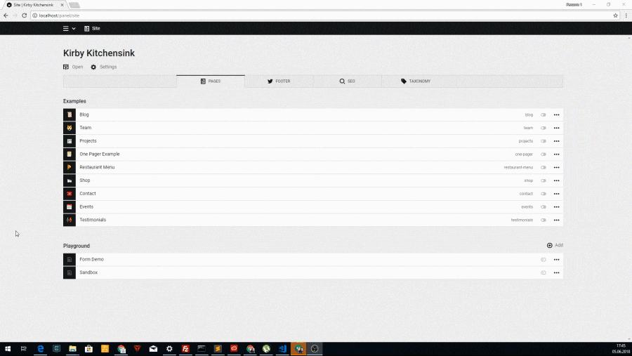

# Kirby 3 CommaShiP
A Kirby 3 command palette for the panel. 



## Installation
Download and copy folder to /site/plugins/commaship

## Usage
Commaship itself has only 2 commands: installing and removing packages.  
One package may contain many commands.

To install a package: login to your panel, press <kbd>Ctrl/Cmd</kbd> + <kbd>Shift</kbd> + <kbd>P</kbd> and search for "install".  

By default only users with `admin` role can install and remove packages.  
You can edit the allowed roles by setting the kirby option `commaship/installer-roles`:

<small>config.php</small>
```php
return [
  'commaship/installer-roles' => ['admin'],
  //...
]
```
An empty array would disable the installation option alltogether. 


## Developing commands
Command Packages are just Kirby 3 plugins with some extras. Making it easy to add support for commaship in your existing plugins.

Commaship exposes a function to the global namespace to register commands, all the commands need to be registered immediately when the plugin file is loaded.

```js
if (window.commaship) {
  commaship.register('package name', [
    {
      id: 'unique command id',
      label: 'This is the name of the command',
      description: 'This is a short description of the command',

      action: function(root) { 
        alert('Hello World!');
      },

      filter: function(root) {
        return root.$store.state.user.current !== null //show only for logged in users
      },
    },
    // other commands
  ]
} else {
  console.warn('commaship not loaded')
}
``` 

`commaship.register` accepts 2 arguments:
1. **packageName** is used as namespace for your commands, it should be unique among all installable packages
2. **commands** is an array of command objects.

Each command object should have the following properties:
- **id**: a unique identifier among all commands in your package
- **label**: the command label you want to show to the user
- **description**: the command description you want to show to the user
- **action**: the callback function which is run when the user selects your option.  
  The panel root component will be passed to your function, 
  this can be used to access the Panel App properties (such as the Vuex store, the Api client, etc...).  
  Your action function might return:
  - a new array of commands or a Promise that resolves to an array of commands
  - a string which will be shown to the user
  - an instance of `commaship.Dialogue` to enter a more interactive mode (see below)
  - an instance of `commaship.Question` to ask the user a question and get a text response back (best used in "Dialogue mode" - see below)
- **filter**: *optional*. A callback function to hide the command.  
  Depending on context you might want to *hide* your command. By default all actions are shown (even on the login screen).  
  Return `true` if you want the command to be visible or `false` to hide it. You can also return a Promise that resolves to a boolean. 

**NOTICE**: Hiding your command from the command panel doesn't make your Api endpoints safe. Always check on the server side if someone has the privilege to do something. 

### Dialogue mode
When your action return an instance of `commaship.Dialogue`, the command panel enters "Dialogue mode". This mode makes it easier to interactively "talk" to the user, either asking questions or printing out text. (hence "Dialogue", like in "dialoguing with someone"). 

`new commaship.Dialogue(generator)` accepts 1 argument:
1. **generator** is a generator function that gets executed by the command panel.

Each `yield` in your generator asks the command panel to show something to the user. This might be simply text, a "question" or an array of commands. Example:

```js
  //...
  action: (root) => new commaship.Dialogue(function*() { 
    const firstname = yield new commaship.Question(`What's your first name?`)
    yield `What a lovely name, "${firstname}"`
    const lastname  = yield new commaship.Question(`What's your last name?`)
    return `Nice to meet you ${firstname} ${lastname}!`
  }),
  //...
```

## Publishing packages
Packages should be distributed as zip files (like those generated by github) and be registered in a central registry.  
The default official and curated registry is here: [github.com/Commaship/packages](https://github.com/Commaship/packages).

If you want to publish your plugin on the commaship registry, you need to include a `commaship.json` file in your root directory. As an example:

```json
{
  "name": "rasteiner\/worldgreeter",
  "label": "World Greeter",
  "description": "A Commaship plugin that salutes the world like a pro. (demo purposes)",
  "url": "https:\/\/github.com\/Commaship\/world-greeter",
  "id": "https:\/\/github.com\/Commaship\/world-greeter\/archive\/master.zip"
}
```

Once your plugin is ready, open an issue on the [registry repository](https://github.com/Commaship/packages/issues)

## Private registry
You may want to use your own registry if you need to have full control over which packages should be installable.  
You can edit the registry endpoint by setting the kirby config option `commaship/registry`:

<small>config.php</small>
```php
return [
  'commaship/registry' => 'http://www.example.com/my/own/registry.json',
  //...
]
```
